# LƯU ĐỒ THUẬT TOÁN CHƯƠNG TRÌNH CHÍNH (main.c)

## 1. KIẾN TRÚC NON-BLOCKING (KHÔNG CHẶN)

Chương trình chính sử dụng **kiến trúc Non-Blocking Loop** thay vì Multi-Threading để đảm bảo:

### ✅ **Ưu điểm của Non-Blocking trên STM32:**
1. **Tính xác định (Deterministic)**: Không có race condition, deadlock, priority inversion
2. **Tiết kiệm RAM**: Không cần stack riêng cho mỗi thread (STM32F103 chỉ có 20KB RAM)
3. **Dễ debug**: Luồng thực thi tuyến tính, dễ trace lỗi
4. **Real-time response**: ISR xử lý tín hiệu quan trọng (E-Stop, Step pulse), main loop xử lý logic

### 🔑 **Nguyên lý hoạt động:**
- **Main Loop (`while(1)`)**: Liên tục quét (polling) các module theo chu kỳ (~10-50µs/vòng)
- **Mỗi hàm trả về ngay**: Không có `delay()`, `while()` chặn, hoặc vòng lặp dài
- **State Machine**: Các module sử dụng máy trạng thái để nhớ tiến độ giữa các lần gọi
- **Flag-based Communication**: ISR đặt cờ, main loop kiểm tra và xóa cờ

### ⚡ **So sánh với Multi-Threading:**
| **Non-Blocking (Dùng)** | **Multi-Threading (Không dùng)** |
|------------------------|----------------------------------|
| 1 stack (~2KB)         | N stacks (N×2KB = tràn RAM)     |
| Không cần RTOS         | Cần FreeRTOS/CMSIS-RTOS         |
| Polling 10-50µs/vòng   | Context switch ~50-200µs        |
| ISR priority đơn giản  | Phức tạp (mutex, semaphore)     |

---

## 2. LƯU ĐỒ THUẬT TOÁN

```plantuml
@startuml
!theme plain
skinparam backgroundColor #FEFEFE
skinparam roundcorner 10
skinparam shadowing false

start

:Khởi tạo phần cứng;
note right
  - HAL_Init()
  - SystemClock_Config() (72 MHz)
  - MX_GPIO_Init()
  - MX_TIM2_Init() (PWM Băng tải)
  - MX_TIM3_Init() (Step Pulse)
  - MX_TIM4_Init() (PWM Servo)
  - MX_USB_DEVICE_Init()
end note

:Khởi tạo các module phần mềm;
note right
  - status_led_init()
  - cdc_handler_init()
  - queue_init()
  - robot_init()
  - conveyor_init()
  - button_handler_init()
end note

:Đợi USB CDC ổn định\n(HAL_Delay(100));

:Gửi "SYS_READY" qua USB;

partition "**VÒNG LẶP CHÍNH (Non-Blocking)**" {
  repeat
    
    :Kiểm tra lệnh từ USB\ncdc_handler_get_command();
    if (Có lệnh mới?) then (Có)
      :Phân tích và thực thi lệnh\nparse_command();
      note right
        - PING, HOME, STATUS
        - ADD_BLOCK (thêm vào queue)
        - CONVEYOR, BTN_LED
        - FLUSH_BUFFER
      end note
    else (Không)
    endif
    
    :Xử lý hàng đợi\nqueue_process();
    note right
      **Luồng:**
      1. Kiểm tra điều kiện:
         - Robot IDLE?
         - Queue không rỗng?
         - Đã homing?
      2. Lấy block từ FIFO
      3. Gọi robot_execute_block()
         → Tính DDS
         → Set Servo + Pump
         → **BẬT TIM3 ISR**
    end note
    
    :Xử lý thông báo DONE\nqueue_handle_done_messages();
    note right
      Hàm tự kiểm tra cờ done_flag
      và gửi "DONE:id" nếu có
    end note
    
    :GIÁM SÁT CẢM BIẾN & NÚT BẤM;
    note right
      **1. Button Debounce:**
      - button_handler_update() (50ms filter)
      
      **2. E-Stop Edge Detection:**
      - So sánh trạng thái hiện tại vs trước
      - Nếu thay đổi → Gửi STATUS
      
      **3. Button Events:**
      - button_just_pressed(START/STOP)
      - Nếu nhấn → Gửi STATUS
      
      **4. Tray Sensor (PB15):**
      - Đọc GPIO → Edge detection
      - Debounce 20ms + Xác nhận
      - Nếu thay đổi → Gửi STATUS
    end note
    
    :Cập nhật trạng thái Homing\nrobot_update_homing_state();
    note right
      State machine tự xử lý
      RAISING/BACKING_OFF/DONE
      nếu đang homing
    end note
    
    :Kiểm tra Servo Idle\nrobot_poll_servo_idle();
    note right
      Hàm tự kiểm tra idle > 2s
      và ngắt PWM nếu cần
    end note
    
    :Xóa cờ Homing LS\n(3 motors);
    note right
      Clear flags mỗi vòng
      để tránh memory leak
    end note
    
    :Cập nhật LED\nstatus_led_update();
    note right
      State machine LED
      (IDLE/RUNNING/ERROR/ESTOP)
    end note
    
    :WATCHDOG & ERROR HANDLING\n(Kiểm tra các cờ từ ISR);
    note right
      **Main kiểm tra và xử lý 5 loại lỗi:**
      1. Homing timeout (>10s RAISING)
      2. Homing timeout backing off
      3. Homing done → Gửi "HOME_DONE"
      4. Homing dir misconfig
      5. Limit Switch stuck (3 motors)
      6. Chạm LS bất ngờ → CRITICAL
      
      **Hành động khi lỗi:**
      - Gửi thông báo lỗi qua USB
      - robot_abort() nếu cần
      - queue_flush() nếu CRITICAL
    end note
    
  repeat while (Mãi mãi)
}

stop

@enduml
```

---

## 3. THUYẾT MINH LƯU ĐỒ

### 📌 **A. Giai đoạn Khởi tạo (Initialization)**

#### **Bước 1: Khởi tạo phần cứng**
- `HAL_Init()`: Reset tất cả peripheral, khởi tạo Flash interface và SysTick
- `SystemClock_Config()`: Cấu hình clock 72 MHz từ thạch anh ngoài 8 MHz (HSE) qua PLL
- `MX_GPIO_Init()`: Cấu hình 30+ GPIO pins cho:
  - Output: 6 pins động cơ (STEP/DIR), 1 pin bơm, 1 pin băng tải, 4 LED
  - Input: 3 Limit Switch, 2 nút bấm, 1 E-Stop (ngắt), 1 cảm biến khay
- `MX_TIM2_Init()`: Timer 2 - PWM cho băng tải (10 kHz)
- `MX_TIM3_Init()`: Timer 3 - Tạo xung Step cho động cơ (40 kHz max)
- `MX_TIM4_Init()`: Timer 4 - PWM cho Servo (50 Hz, 20ms period)
- `MX_USB_DEVICE_Init()`: Khởi tạo USB CDC Virtual COM Port

#### **Bước 2: Khởi tạo các module phần mềm**
- `status_led_init()`: State machine LED (IDLE/RUNNING/ERROR/ESTOP)
- `cdc_handler_init()`: Circular buffer 512 bytes cho USB RX/TX
- `queue_init()`: Hàng đợi 32 lệnh di chuyển (FIFO)
- `robot_init()`: Máy trạng thái robot, DDS stepper control, kinematics
- `conveyor_init()`: Điều khiển PWM băng tải
- `button_handler_init()`: Debounce 50ms cho 3 nút (START/STOP/E-STOP)

#### **Bước 3: Gửi tín hiệu sẵn sàng**
- Delay 100ms để USB CDC ổn định (enumeration hoàn tất)
- Gửi `"SYS_READY"` lên PC để báo hiệu firmware đã boot thành công

---

### 📌 **B. Vòng lặp chính (Main Loop)**

Vòng lặp `while(1)` chạy liên tục với tần số ~10,000-50,000 vòng/giây (20-100µs/vòng).

#### **🔄 Bước 1: Nhận và xử lý lệnh từ USB**
- **`cdc_handler_get_command()`**: Kiểm tra circular buffer có lệnh mới không
  - Nếu có: Trả về chuỗi lệnh (ví dụ: `"ADD_BLOCK:123:{"t":500,...}"`)
  - Nếu không: Trả về `false`, bỏ qua
- **`parse_command()`**: Phân tích cú pháp lệnh và gọi handler tương ứng:
  - `PING` → Trả lời `PONG`, tự động enable motors
  - `HOME` → Bắt đầu homing sequence
  - `ADD_BLOCK` → Parse JSON, thêm vào queue
  - `CONVEYOR:START:FWD` → Khởi động băng tải
  - `STATUS` → Gửi trạng thái đầy đủ
  - `FLUSH_BUFFER` → Dừng robot + xóa queue

**💡 Non-blocking:** Parse command chỉ mất ~50-200µs, không chặn vòng lặp.

#### **🔄 Bước 2: Xử lý hàng đợi lệnh**
- **`queue_process()`** (trong `command_queue.c`): 
  - Hàm này **TỰ KIỂM TRA** các điều kiện bên trong:
    - Robot đang IDLE? (`robot_get_state() == ROBOT_STATE_IDLE`)
    - Queue không rỗng? (`queue_count > 0`)
    - Đã homing? (`robot_is_homed() == true`)
  - **→ Nếu thỏa mãn:** Lấy lệnh đầu tiên từ queue, gọi `robot_execute_motion_block()`
  - **→ Nếu KHÔNG:** Trả về ngay, không làm gì
- **Main.c CHỈ GỌI** `queue_process()`, không kiểm tra điều kiện
- **`queue_handle_done_messages()`**: Kiểm tra cờ `done_flag` (do ISR TIM3 đặt):
  - Nếu có: Gửi `"DONE:id"` lên PC, xóa cờ

**💡 Non-blocking:** Main loop chỉ gọi hàm, logic kiểm tra nằm trong module queue.

#### **🔄 Bước 3: Cập nhật nút bấm (Debounce)**
- **`button_handler_update()`**: Quét trạng thái 3 nút mỗi vòng lặp
  - Software debounce: Chỉ chấp nhận nếu trạng thái giữ ổn định 50ms
  - Phát hiện cạnh lên/xuống → Gọi callback
  - E-Stop callback → `robot_estop_triggered()` (dừng ngay)

#### **🔄 Bước 4: Giám sát E-Stop & Nút bấm**
- **E-Stop Edge Detection**: So sánh trạng thái hiện tại với `last_estop_val`
  - Nếu thay đổi → Gửi `STATUS` ngay để PC đồng bộ
- **Button Events**: Kiểm tra `button_just_pressed()`
  - START/STOP nhấn → Gửi `STATUS` để PC cập nhật UI

#### **🔄 Bước 5: Giám sát cảm biến khay**
- Đọc GPIO PB15 (NPN NO sensor):
  - `GPIO_PIN_RESET` (0V) = Có sản phẩm
  - `GPIO_PIN_SET` (3.3V) = Không có sản phẩm
- **Hardware debounce:** Nếu thay đổi → Delay 20ms → Đọc lại xác nhận
- Nếu xác nhận đúng → Gửi `STATUS` lên PC

**💡 Edge Detection:** Chỉ gửi khi có thay đổi, không spam USB.

#### **🔄 Bước 6: Cập nhật trạng thái Homing**
- **`robot_update_homing_state()`**: State machine xử lý 3 giai đoạn:
  1. **RAISING**: Nâng 3 trục lên đến chạm Limit Switch
  2. **BACKING_OFF**: Lùi xuống 50 steps để thoát khỏi LS
  3. **DONE**: Đặt cờ `homing_done`, reset vị trí về (0,0,0)

**💡 Non-blocking State Machine:** Mỗi lần gọi chỉ kiểm tra trạng thái, không chặn.

#### **🔄 Bước 7: Servo Auto-Detach**
- **`robot_poll_servo_idle()`**: Kiểm tra servo không thay đổi góc >2 giây
  - Nếu idle → Ngắt PWM (`HAL_TIM_PWM_Stop()`) để giảm nhiệt
  - Khi cần dùng lại → Tự động bật PWM

#### **🔄 Bước 8: Clear Flags (Maintenance)**
- Xóa 3 cờ `homing_ls_triggered[]` để tránh memory leak
- Các cờ này được ISR đặt khi chạm Limit Switch trong quá trình Homing

#### **🔄 Bước 9: Cập nhật LED trạng thái**
- **`status_led_update()`**: Điều khiển LED System theo state:
  - IDLE: Tắt
  - RUNNING: Sáng
  - ERROR: Nhấp nháy nhanh (200ms)
  - ESTOP: Nhấp nháy chậm (500ms)

---

### 📌 **C. Watchdog & Error Handling**

#### **🚨 Watchdog 1: Homing Timeout**
- **Điều kiện:** Robot đang ở trạng thái `HOMING_STATE_RAISING`
- **Timeout:** 10 giây (HOMING_WATCHDOG_MS)
- **Hành động:**
  - Dừng robot (`robot_abort()`)
  - Gửi lỗi `"ERROR:Homing timed out"`
- **Nguyên nhân:** Limit Switch hỏng, động cơ bị kẹt, cấu hình sai

#### **🚨 Error 2: Homing Timeout Backing Off**
- ISR phát hiện backing off quá lâu (>2000 steps)
- Gửi `"ERROR:HOMING_TIMEOUT_BACKING_OFF"`

#### **🚨 Success: Homing Done**
- ISR đặt cờ `homing_done` khi hoàn thành
- Main loop gửi `"HOME_DONE"` lên PC
- PC hiển thị "Homing successful"

#### **🚨 Error 3: Homing Direction Misconfiguration**
- Động cơ quay ngược hướng (không chạm LS sau 10s)
- Gửi `"ERROR:HOMING_DIR_MISCONFIG on motor X"`
- Yêu cầu kiểm tra đấu dây DIR

#### **🚨 Error 4: Limit Switch Stuck**
- **Điều kiện:** Backing off >2000 steps mà LS vẫn kích hoạt
- **Hành động:**
  - Gửi `"ERROR:LIMIT_SWITCH_STUCK:M1 (backoff >2000 steps, sensor may be broken)"`
  - Dừng khẩn cấp (`robot_abort()`)
- **Nguyên nhân:** Sensor hỏng, dây ngắn mạch, vật cản cơ học

#### **🚨 Error 5: Unexpected Limit Switch Hit (CRITICAL)**
- **Điều kiện:** Robot đang di chuyển bình thường (MOVING), chạm LS bất ngờ
- **Hành động:**
  1. Gửi `"ERROR:CRITICAL:Motor X hit limit switch during move!"`
  2. Dừng robot ngay (`robot_abort()`)
  3. Xóa toàn bộ hàng đợi (`queue_flush()`)
  4. Gửi `"ERROR:REQUIRE_HOMING"`
- **Nguyên nhân:** 
  - **Mất bước (Lost steps):** Động cơ bị quá tải, xung bị lỗi
  - **Position mismatch:** Vị trí lưu trong firmware sai so với thực tế
  - **Cơ học:** Va chạm, vật cản

**⚠️ Tại sao CRITICAL?** Vì vị trí tuyệt đối đã sai, các lệnh tiếp theo sẽ di chuyển sai tọa độ → Có thể va chạm, hỏng robot.

---

## 4. ĐẶC ĐIỂM KỸ THUẬT

### ⏱️ **Timing Analysis**
- **Vòng lặp chính:** ~20-100µs/vòng (10,000-50,000 vòng/giây)
- **ISR TIM3 (Step Pulse):** Chạy mỗi 25µs (40 kHz max) khi robot di chuyển
- **ISR E-Stop:** Độ trễ <2µs từ khi nhấn nút đến dừng động cơ
- **USB CDC latency:** <5ms từ khi PC gửi lệnh đến khi STM32 nhận

### 🧠 **Memory Footprint**
- **RAM Usage:** ~8KB/20KB (40%)
  - Circular buffer USB: 512 bytes
  - Command queue: 32 blocks × 32 bytes = 1024 bytes
  - Stack: ~2KB
  - Heap: Không dùng (tránh fragmentation)
- **Flash Usage:** ~24KB/64KB (37%)

### 🔒 **Safety Features**
1. **Hardware E-Stop:** Ngắt ngoại vi PA8, dừng <2µs
2. **Software Debounce:** 50ms filter cho nút bấm
3. **Watchdog:** 5 loại timeout/error detection
4. **Position Validation:** Kiểm tra Limit Switch trong lúc di chuyển
5. **Queue Flush:** Xóa lệnh cũ khi phát hiện lỗi

### 📊 **Performance**
- **Max Step Rate:** 20,000 steps/s/motor (40 kHz timer ÷ 2 edges)
- **Max Speed:** ~120mm/s (phụ thuộc vào step/mm)
- **Min Move Time:** 10ms (validation trong `ADD_BLOCK`)
- **Homing Accuracy:** ±0.1mm (phụ thuộc vào Limit Switch)

---

## 5. TÓM TẮT

Chương trình chính sử dụng **kiến trúc Non-Blocking Polling Loop** để:
1. **Đảm bảo tính xác định:** Không có race condition, dễ debug
2. **Tối ưu RAM:** Chỉ 1 stack, không cần RTOS
3. **Real-time response:** ISR xử lý tín hiệu quan trọng (<2µs)
4. **An toàn:** 5 loại watchdog/error detection
5. **Hiệu năng:** 10,000+ vòng lặp/giây, latency <100µs

Lưu đồ trên mô tả **luồng thực thi tuyến tính** của vòng lặp chính, với các module được gọi tuần tự mỗi vòng lặp để kiểm tra trạng thái, xử lý lệnh, và phát hiện lỗi.
