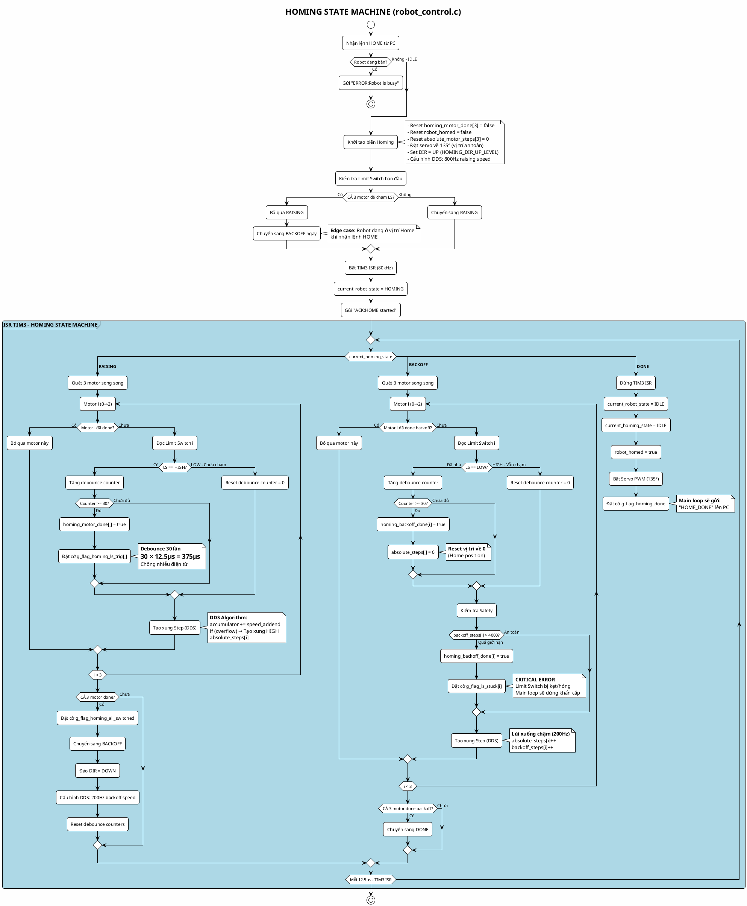

# LƯU ĐỒ THUẬT TOÁN HOMING STATE MACHINE

## 1. GIỚI THIỆU

**Homing** (Tìm điểm gốc) là quá trình **tự động hiệu chuẩn vị trí** của robot Delta bằng cách:
- Nâng 3 trục lên đến khi chạm **Limit Switch** (công tắc hành trình)
- Lùi xuống 1 khoảng nhỏ để thoát khỏi cảm biến
- Reset vị trí tuyệt đối về giá trị chuẩn (0 steps)

### ✅ **Tại sao cần Homing?**
1. **Khắc phục mất bước:** Động cơ bước có thể mất bước do quá tải, dẫn đến vị trí firmware ≠ vị trí thực tế
2. **Khởi động an toàn:** Khi bật nguồn, STM32 không biết robot đang ở đâu
3. **Chuẩn hóa tọa độ:** Đảm bảo tọa độ (0,0,0) luôn chính xác

### 🔑 **Đặc điểm kỹ thuật:**
- **3 trạng thái chính:** IDLE → RAISING → BACKOFF → DONE
- **Chạy trong ISR TIM3:** Real-time, độ chính xác cao (12.5µs/tick @ 80kHz)
- **Debounce hardware:** 30 lần đọc liên tục để xác nhận tín hiệu cảm biến
- **Safety watchdog:** Timeout 10s, max backoff 4000 steps

---

## 2. LƯU ĐỒ THUẬT TOÁN



---

## 3. THUYẾT MINH CHI TIẾT

### 📌 **A. Giai đoạn Khởi tạo (robot_start_homing)**

#### **Bước 1: Kiểm tra điều kiện**
- Chỉ chấp nhận HOME khi `current_robot_state == IDLE`
- Nếu đang MOVING hoặc HOMING → Trả lỗi `"ERROR:Robot is busy"`

#### **Bước 2: Reset biến trạng thái**
```c
for(int i=0; i<3; i++) homing_motor_done[i] = false;
robot_homed = false;
absolute_motor_steps[0] = 0;
absolute_motor_steps[1] = 0;
absolute_motor_steps[2] = 0;
```
- Reset tất cả cờ hoàn thành
- Xóa trạng thái homed cũ
- Reset bộ đếm bước tạm thời (sẽ được set lại sau khi backoff)

#### **Bước 3: Cấu hình phần cứng**
- **Servo:** Đặt góc 135° (vị trí an toàn, tránh va chạm)
- **DIR pins:** Set HIGH (HOMING_DIR_UP_LEVEL) để đi lên
- **DDS speed:** 800 Hz (tương đương ~800 steps/s mỗi motor)

#### **Bước 4: Kiểm tra Edge Case**
```c
GPIO_PinState init_ls1 = HAL_GPIO_ReadPin(LS1_GPIO_Port, LS1_Pin);
if (init_ls1 == GPIO_PIN_SET) { homing_motor_done[0] = true; }
```
- **Tình huống:** Robot đã ở vị trí Home khi nhận lệnh
- **Xử lý:** Bỏ qua RAISING, chuyển thẳng sang BACKOFF
- **Lý do:** Tránh va đập vào giới hạn cơ khí

#### **Bước 5: Khởi động DDS**
- Tính `speed_addend` cho 800 Hz:
  ```c
  speed_addend = (800 × DDS_CONST) = (800 × 53688) = 42,950,400
  ```
- Khởi tạo `accumulator = 0` cho cả 3 motor
- Bật ngắt TIM3 → ISR bắt đầu chạy

---

### 📌 **B. Trạng thái RAISING (Nâng lên tìm Home)**

Chạy trong **ISR TIM3**, được gọi mỗi **12.5µs** (80 kHz).

#### **Vòng lặp chính (3 motors song song):**

```c
for (int i = 0; i < 3; i++) {
    if (!homing_motor_done[i]) {
        // 1. Kiểm tra Limit Switch
        if (robot_is_limit_switch_triggered_fast(i)) {
            homing_confirmation_counter[i]++;
            if (homing_confirmation_counter[i] >= HOMING_DEBOUNCE_COUNT) {
                homing_motor_done[i] = true;
            }
        } else {
            homing_confirmation_counter[i] = 0;
        }
        
        // 2. Tạo xung Step (DDS)
        uint32_t old_acc = motor_states[i].accumulator;
        motor_states[i].accumulator += motor_states[i].speed_addend;
        
        if (motor_states[i].accumulator < old_acc) { // Overflow
            // Tạo xung HIGH
            motor_states[i].pul_port->BSRR = motor_states[i].pul_pin;
            absolute_motor_steps[i]--; // Đi lên = giảm steps
        } else {
            // Xung LOW
            if (motor_states[i].pul_state) {
                motor_states[i].pul_port->BSRR = (uint32_t)motor_states[i].pul_pin << 16U;
            }
        }
    }
}
```

#### **🔍 Debounce Algorithm:**
- **Vấn đề:** Limit Switch cơ học có nhiễu, có thể bouncing (nảy)
- **Giải pháp:** Yêu cầu 30 lần đọc **LIÊN TIẾP** đều là HIGH
- **Thời gian:** 30 × 12.5µs = **375µs** (đủ để loại bỏ nhiễu)
- **Reset counter:** Nếu có 1 lần đọc LOW → Counter = 0, bắt đầu lại

#### **⚙️ DDS (Digital Differential Analyzer):**
- **Nguyên lý:** Tạo xung với tần số chính xác bằng cách tích lũy
- **Công thức:** 
  ```
  Nếu (accumulator + speed_addend) tràn 32-bit → Tạo xung
  Tần số xung = speed_addend / DDS_CONST (Hz)
  ```
- **Ưu điểm:** Không cần chia, chỉ cộng → Rất nhanh trong ISR

#### **🔄 Điều kiện chuyển sang BACKOFF:**
```c
if (all_homed) { // Cả 3 motor đều done
    current_homing_state = HOMING_STATE_BACKOFF;
    
    // Đảo chiều
    HAL_GPIO_WritePin(M1_DIR_GPIO_Port, M1_DIR_Pin, HOMING_DIR_DOWN_LEVEL);
    
    // Giảm tốc độ (200 Hz cho backoff chậm, chính xác)
    uint32_t backoff_speed_addend = (200 × DDS_CONST);
}
```

---

### 📌 **C. Trạng thái BACKOFF (Lùi xuống khỏi cảm biến)**

#### **Mục đích:**
1. **Thoát khỏi Limit Switch:** Để cảm biến nhả (LOW)
2. **Định vị chính xác:** Dừng ngay khi cảm biến vừa nhả
3. **Reset vị trí:** Đặt `absolute_steps[i] = 0` tại điểm này

#### **Vòng lặp chính:**

```c
for (int i = 0; i < 3; i++) {
    if (!homing_backoff_done[i]) {
        // 1. Kiểm tra cảm biến đã nhả chưa
        if (!robot_is_limit_switch_triggered_fast(i)) { // LOW = Đã nhả
            homing_confirmation_counter[i]++;
            if (homing_confirmation_counter[i] >= HOMING_BACKOFF_DEBOUNCE_COUNT) {
                homing_backoff_done[i] = true;
                absolute_motor_steps[i] = STEPS_AT_HOME_NEG45; // = 0
            }
        } else {
            homing_confirmation_counter[i] = 0;
        }
        
        // 2. Safety: Kiểm tra lùi quá xa
        if (homing_backoff_steps[i] > HOMING_MAX_BACKOFF_STEPS) { // 4000 steps
            homing_backoff_done[i] = true;
            g_flag_ls_stuck[i] = true; // Cảm biến bị kẹt!
        }
        
        // 3. Tạo xung Step (DDS)
        // ... (tương tự RAISING nhưng absolute_steps[i]++)
        homing_backoff_steps[i]++; // Đếm số bước đã lùi
    }
}
```

#### **🚨 Safety Watchdog:**
- **Giới hạn:** Max 4000 steps backoff (tương đương ~10mm @ 400 steps/mm)
- **Lý do:** Nếu lùi quá xa mà cảm biến vẫn HIGH → Cảm biến hỏng/dây ngắn mạch
- **Hành động:** 
  - Đặt cờ `g_flag_ls_stuck[i]`
  - Main loop sẽ phát hiện → Gửi lỗi → Dừng khẩn cấp

#### **📍 Reset vị trí:**
```c
absolute_motor_steps[i] = STEPS_AT_HOME_NEG45; // = 0
```
- **Ý nghĩa:** Điểm này (vừa nhả Limit Switch) là vị trí gốc (0 steps)
- **Trong báo cáo PC:** Vị trí này tương ứng góc -45° (Home Angle)

---

### 📌 **D. Trạng thái DONE (Hoàn thành)**

#### **Hành động:**
1. **Dừng ISR:** `HAL_TIM_Base_Stop_IT(&htim3)`
2. **Reset state:** 
   - `current_robot_state = IDLE`
   - `current_homing_state = IDLE`
   - `robot_homed = true`
3. **Bật Servo:** 
   - Khởi động PWM TIM4
   - Đặt góc 135° (vị trí an toàn)
4. **Đặt cờ:** `g_flag_homing_done = true`

#### **Main loop xử lý:**
```c
// Trong main.c - WATCHDOG section
if (robot_get_and_clear_flag_homing_done()) {
    cdc_handler_send_response("HOME_DONE");
}
```
- PC nhận `"HOME_DONE"` → Hiển thị thông báo thành công
- Từ giờ robot có thể nhận lệnh di chuyển

---

## 4. XỬ LÝ LỖI VÀ EDGE CASES

### 🚨 **Error 1: Homing Timeout (Main Loop)**
```c
// Trong main.c
if (robot_get_state() == ROBOT_STATE_HOMING && 
    robot_get_homing_state() == HOMING_STATE_RAISING) {
    if ((HAL_GetTick() - robot_get_homing_start_tick()) > HOMING_WATCHDOG_MS) {
        robot_abort();
        cdc_handler_send_response("ERROR:Homing timed out");
    }
}
```
- **Timeout:** 10 giây
- **Nguyên nhân:** Limit Switch hỏng, motor không quay, cấu hình DIR sai
- **Hành động:** Dừng robot, gửi lỗi

### 🚨 **Error 2: Limit Switch Stuck**
```c
// Trong ISR - BACKOFF state
if (homing_backoff_steps[i] > HOMING_MAX_BACKOFF_STEPS) {
    g_flag_ls_stuck[i] = true;
}

// Main loop xử lý
if (robot_get_and_clear_flag_ls_stuck(i)) {
    cdc_handler_send_response("ERROR:LIMIT_SWITCH_STUCK:M%d", i+1);
    robot_abort();
}
```

### ✅ **Edge Case: Pre-triggered Limit Switch**
```c
// Trong robot_start_homing()
if (init_ls1 == GPIO_PIN_SET) { homing_motor_done[0] = true; }
if (homing_motor_done[0] && homing_motor_done[1] && homing_motor_done[2]) {
    current_homing_state = HOMING_STATE_BACKOFF; // Bỏ qua RAISING
}
```
- **Tình huống:** Robot đã ở vị trí Home
- **Xử lý:** Chuyển thẳng sang BACKOFF để xác nhận vị trí chính xác

---

## 5. ĐẶC ĐIỂM KỸ THUẬT

### ⏱️ **Timing Analysis**
- **ISR frequency:** 80 kHz (12.5µs/tick)
- **Raising speed:** 800 Hz (~800 steps/s)
- **Backoff speed:** 200 Hz (~200 steps/s, chậm để chính xác)
- **Debounce time:** 30 × 12.5µs = 375µs
- **Max homing time:** ~10s (watchdog)

### 🧠 **Memory Usage**
- **State variables:** ~48 bytes
  - `homing_motor_done[3]`: 3 bytes
  - `homing_backoff_done[3]`: 3 bytes
  - `homing_confirmation_counter[3]`: 12 bytes (uint32_t × 3)
  - `homing_backoff_steps[3]`: 12 bytes
  - Flags: ~18 bytes
- **No heap allocation:** Tất cả static/stack

### 📊 **Performance**
- **Độ chính xác vị trí:** ±1 step (±0.0025mm @ 400 steps/mm)
- **Repeatability:** ±0.1mm (phụ thuộc Limit Switch cơ khí)
- **Thời gian homing:** ~5-8s (tùy vị trí ban đầu)

### 🔒 **Safety Features**
1. **Debounce 375µs:** Chống nhiễu điện từ
2. **Timeout 10s:** Phát hiện Limit Switch hỏng
3. **Max backoff 4000 steps:** Phát hiện Limit Switch kẹt
4. **Watchdog trong Main:** Giám sát trạng thái RAISING

---

## 6. TÓM TẮT

**Homing State Machine** sử dụng **3-state FSM (Finite State Machine)** chạy trong **ISR real-time** để:
1. **RAISING:** Nâng 3 motor song song, debounce 375µs khi chạm Limit Switch
2. **BACKOFF:** Lùi chậm (200 Hz), reset vị trí khi cảm biến vừa nhả
3. **DONE:** Dừng ISR, bật servo, đặt cờ thành công

**Đặc điểm nổi bật:**
- **DDS algorithm:** Tạo xung chính xác không cần chia
- **Debounce hardware:** 30 lần đọc liên tục
- **Safety watchdog:** 3 loại timeout/error detection
- **Non-blocking:** ISR chạy độc lập, Main loop xử lý cờ
